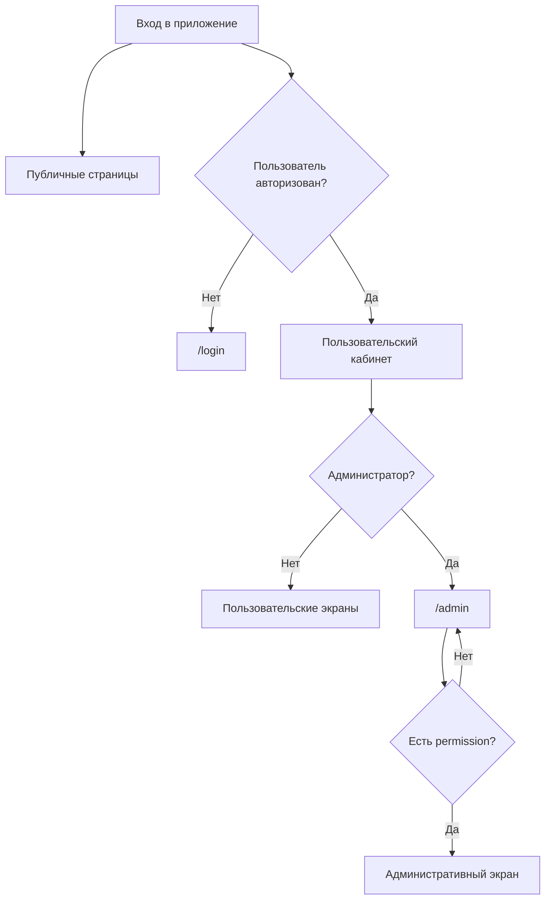
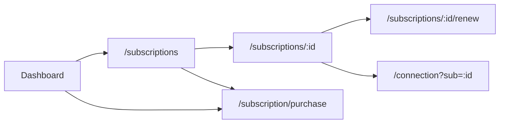
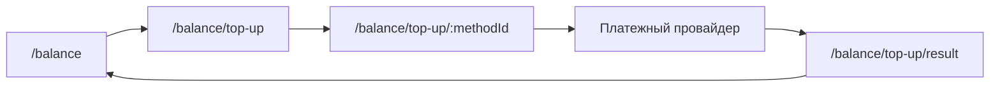

# Карта интерфейса Custom Cabinet

Дата фиксации: 2 сентября 2026 года<br>
Исходная точка: `4638234` (`Reset scroll on regular route changes`) и текущая локальная реализация<br>
Версия проекта: `1.66.0`

## 1. Назначение документа

Этот документ описывает фактическую информационную архитектуру и навигацию Custom Cabinet:

- режимы интерфейса и глобальные оболочки;
- публичные, пользовательские и административные экраны;
- точки входа, основные переходы и динамические URL;
- различия между desktop, mobile web и Telegram Mini App;
- правила доступа, permissions и feature flags;
- состояния, которые меняют экран без изменения URL;
- известные разрывы и неоднозначности текущей навигации.

Это карта существующей реализации, а не спецификация будущего интерфейса. Визуальные и UX-проблемы подробно разобраны в [`DESIGN_UX_UI_AUDIT.md`](DESIGN_UX_UI_AUDIT.md).

## 2. Источники истины

| Область | Основной источник |
|---|---|
| Реестр маршрутов | `src/App.tsx` |
| React Router и Telegram Back Button | `src/AppWithNavigator.tsx` |
| Общая оболочка | `src/components/layout/AppShell/AppShell.tsx` |
| Mobile header и drawer | `src/components/layout/AppShell/AppHeader.tsx` |
| Mobile bottom navigation | `src/components/layout/AppShell/MobileBottomNav.tsx` |
| Административное меню | `src/pages/AdminPanel.tsx` |
| Проверка permissions | `src/components/auth/PermissionRoute.tsx` |
| Feature flags | `src/hooks/useFeatureFlags.ts` |

## 3. Общая модель интерфейса

Custom Cabinet состоит из трех связанных режимов:

1. Публичные и транзакционные страницы без общей оболочки кабинета.
2. Пользовательский кабинет для web и Telegram Mini App.
3. Административная консоль с отдельной картой разделов и RBAC.

Пользовательский режим использует упрощенную модель: Главная является единым
центром подписки, устройств и баланса. Старые пользовательские URL сохранены как
compatibility entry points и открывают нужный overlay поверх Главной.



Техническая цепочка запуска:

```text
index.html
  -> src/main.tsx
    -> AppWithNavigator
      -> BrowserRouter
        -> App
          -> Routes
```

Nginx возвращает `index.html` для неизвестного физического пути, после чего маршрут обрабатывает React Router. Неизвестный client-side URL перенаправляется на `/`.

## 4. Глобальные оболочки

### 4.1. Публичная оболочка

Публичные страницы не используют основной `Layout`. Каждый экран самостоятельно определяет фон, ширину, действия и состояния загрузки.

Юридический footer доступен на `/login`, если backend-настройка `footerEnabled` включена. Он содержит ссылки на оферту, политику конфиденциальности и условия рекуррентных платежей.

### 4.2. Пользовательская оболочка

`Layout` оборачивает `AppShell`. В пользовательском режиме внутри `AppShell` находятся:

- desktop header;
- Telegram safe-area spacer без видимого mobile header;
- основная область контента;
- mobile bottom navigation;
- WebSocket-уведомления;
- уведомления о кампаниях;
- глобальная success-модалка;
- глобальный prompt dialog host.

Видимый mobile header и пользовательский drawer не монтируются. На маршрутах
`/admin*` прежний mobile header и drawer сохранены, так как административная
консоль не входит в упрощение пользовательского Cabinet.

Фактической основной desktop sidebar нет. Desktop-навигация находится в фиксированном верхнем header.

### 4.3. Blocking overlay

Следующие системные состояния полностью перекрывают текущую страницу без изменения URL:

| Состояние | Экран |
|---|---|
| `maintenance` | Технические работы |
| `channel_subscription` | Обязательная подписка на канал |
| `blacklisted` | Пользователь заблокирован |
| `account_deleted` | Аккаунт удален |
| `backend_unavailable` | Backend недоступен |

В Telegram Mini App Back Button при активном blocking overlay закрывает Mini App вместо перехода по истории.

## 5. Глобальная навигация

### 5.1. Матрица видимости

| Раздел | URL | Desktop header | Mobile drawer | Mobile bottom |
|---|---|---:|---:|---:|
| Главная | `/` | Да | Да | Да |
| Подписки | `/subscriptions` | Нет, compatibility URL | Нет | Нет |
| Баланс | `/balance` | Нет, compatibility URL | Нет | Нет |
| Реферальная программа | `/referral` | Нет | Нет | Нет |
| Подарки | `/gift` | Нет | Нет | Нет |
| Поддержка | `/support` | Да | Нет | Да |
| Информация | `/info` | Через Profile | Нет | Нет |
| Инструкции и настройка | `/instructions` | Через Profile | Нет | Нет |
| Профиль | `/profile` | Да | Нет | Да |
| Конкурсы | `/contests` | Через Profile по feature flag | Нет | Нет |
| Опросы | `/polls` | Через Profile по feature flag | Нет | Нет |
| Колесо | `/wheel` | Через Profile и контекст Главной по feature flag | Нет | Нет |
| Администрирование | `/admin` | Только через Profile администратора | Нет | Нет |

### 5.2. Desktop header

Desktop header показывается начиная с breakpoint `lg`. Логотип ведет на `/`. Справа находятся переключатель темы, уведомления, язык и выход.

Основные пользовательские пункты:

```text
Главная | Поддержка | Профиль
```

`*` Зависит от feature flag.<br>
`**` Только для администратора.

### 5.3. Mobile drawer

В пользовательском режиме mobile drawer удален. На административных маршрутах
сохранен прежний drawer.

```text
Главная
Подписки
Баланс
Рефералы*
Поддержка
Конкурсы*
Опросы*
Колесо*
Подарки*
Информация
---
Администрирование**
---
Профиль
Выход
```

### 5.4. Mobile bottom navigation

Постоянные пользовательские пункты:

```text
Главная | Поддержка | Профиль
```

Unread tickets показываются badge на пункте Поддержка. Feature-функции не
занимают постоянные слоты.

## 6. Публичные экраны

| URL | Экран | Назначение |
|---|---|---|
| `/login` | Login | Основной вход и способы авторизации |
| `/auth/telegram/callback` | TelegramCallback | Завершение Telegram OAuth |
| `/auth/telegram` | TelegramRedirect | Переход к Telegram-авторизации |
| `/tg` | TelegramRedirect | Короткий alias Telegram redirect |
| `/connect` | DeepLinkRedirect | Обработка внешней ссылки подключения |
| `/add` | DeepLinkRedirect | Alias внешней ссылки подключения |
| `/auth/oauth/callback` | OAuthCallback | Завершение внешнего OAuth |
| `/verify-email` | VerifyEmail | Подтверждение email |
| `/reset-password` | ResetPassword | Сброс пароля |
| `/offer` | PublicLegal | Публичная оферта |
| `/privacy` | PublicLegal | Политика конфиденциальности |
| `/recurrent-payments` | PublicLegal | Условия рекуррентных платежей |
| `/merge/:mergeToken` | MergeAccounts | Объединение аккаунтов |
| `/buy/:slug` | QuickPurchase | Публичная покупка по landing slug |
| `/buy/success/:token` | PurchaseSuccess | Результат публичной покупки |
| `/buy/gift/:token` | GiftClaim | Получение подарка |
| `/coupon/:token` | CouponStatus | Просмотр или активация купона |
| `/auto-login?token=...` | AutoLogin | Вход по одноразовому токену |

## 7. Пользовательский кабинет

### 7.1. Главная

| URL | Экран | Основные выходы |
|---|---|---|
| `/` | Unified Dashboard | Выбранная подписка, устройства, подключение, баланс, покупка и условные feature-карточки |

### 7.2. Подписки

| URL | Экран | Назначение |
|---|---|---|
| `/subscriptions` | Unified Dashboard | Compatibility entry на единый центр подписки |
| `/subscriptions/:subscriptionId` | Unified Dashboard + management overlay | Выбранная подписка и вторичные действия |
| `/subscriptions/:subscriptionId?section=additional-options` | Unified Dashboard + management overlay | Управление подпиской с раскрытыми «Дополнительными опциями» для перехода из управления устройствами |
| `/subscriptions/:subscriptionId/renew` | RenewSubscription | Продление подписки |
| `/subscription/purchase` | SubscriptionPurchase | Покупка или смена тарифа |
| `/subscription/:subscriptionId` | Legacy redirect | Переход на `/subscriptions/:subscriptionId` |
| `/subscription` | Legacy redirect | Переход на `/subscriptions` |

Основной поток:



Экран деталей использует sheets без собственного URL для добавления и уменьшения числа устройств, покупки трафика, управления сервером и удаления подписки. Параметр `section=additional-options` восстанавливает раскрытый раздел дополнительных действий, но не открывает конкретный sheet покупки.

### 7.3. Подключение устройства

| URL | Экран | Назначение |
|---|---|---|
| `/connection?sub=:id` | Unified Dashboard + Connection overlay | Шаги platform, application и add subscription |
| `/connection/qr` | ConnectionQR | QR-код и данные подключения |

`/connection/qr` ожидает данные в `location.state`. Прямое открытие без этого состояния возвращает пользователя на `/connection`.

### 7.4. Баланс и пополнение

| URL | Экран | Назначение |
|---|---|---|
| `/balance` | Unified Dashboard + balance details overlay | Compatibility entry к истории, промокоду и сохраненным возможностям Balance |
| `/balance/saved-cards` | SavedCards | Сохраненные платежные карты |
| `/balance/top-up` | Unified Dashboard + top-up overlay | Выбор платежного метода |
| `/balance/top-up/:methodId` | Unified Dashboard + top-up overlay | Ввод суммы и запуск платежа |
| `/balance/top-up/result` | TopUpResult | Результат пополнения |
| `/balance/top-up/result/:method` | TopUpResult | Результат с методом в URL path |



Экраны результата пополнения работают без общей оболочки `Layout`.

### 7.5. Реферальная программа

| URL | Экран | Условие |
|---|---|---|
| `/referral` | Referral | Раздел рефералов и партнерской программы |
| `/referral/partner/apply` | ReferralPartnerApply | Доступен при статусе `none` или `rejected` |
| `/referral/withdrawal/request` | ReferralWithdrawalRequest | Доступен при `can_request=true` |

При отключенной referral-функции прямой вход по `/referral` показывает disabled screen, а не route-level redirect.

### 7.6. Поддержка

| URL | Экран | Локальные состояния без URL |
|---|---|---|
| `/support` | Support | Список тикетов, создание тикета, детали и переписка |

Выбранный пользовательский тикет хранится в локальном React state. Отдельного маршрута `/support/:ticketId` нет.

### 7.7. Профиль и аккаунты

| URL | Экран | Назначение |
|---|---|---|
| `/profile` | Profile | Профиль и пользовательские настройки |
| `/profile/accounts` | ConnectedAccounts | Связанные способы входа и аккаунты |
| `/auth/link/telegram/callback` | LinkTelegramCallback | Завершение привязки Telegram |

### 7.8. Активности

| URL | Экран | Видимость основной ссылки |
|---|---|---|
| `/contests` | Contests | Mobile drawer при наличии конкурсов |
| `/polls` | Polls | Mobile drawer при наличии опросов |
| `/wheel` | Wheel | Mobile drawer и mobile bottom при включенном Wheel |

Feature flags управляют прежде всего видимостью ссылок. Сам `ProtectedRoute` не запрещает прямой вход по этим URL.

### 7.9. Подарки

| URL | Экран | Назначение |
|---|---|---|
| `/gift` | GiftSubscription | Покупка, активация и список подарков |
| `/gift/result` | GiftResult | Результат покупки подарка |

Вкладки `buy`, `activate` и `myGifts` переключаются локально. Query-параметр может задать начальную вкладку, но дальнейшие переключения не синхронизируются с URL.

При выключенном Gift прямой вход показывает disabled screen, после чего выполняется переход на `/`.

### 7.10. Информация и новости

| URL | Экран | Назначение |
|---|---|---|
| `/info` | Info | Встроенные документы и пользовательские информационные вкладки |
| `/info/:slug` | InfoPageView | Отдельная информационная страница |
| `/instructions` | Instructions | Каталог из 13 нативных инструкций по кабинету |
| `/instructions/:slug` | InstructionArticle | Пошаговая инструкция со скриншотами, связанными материалами и безопасным переходом в кабинет |
| `/news/:slug` | NewsArticlePage | Полная статья новости |

На `/info` активная вкладка хранится локально и не отражается в URL.
Инструкции используют стабильные slug-маршруты. При прямом Telegram deep link Back
возвращает из статьи в `/instructions`, затем в `/profile`.

## 8. Административная консоль

### 8.1. Правила входа

`/admin` требует только административный статус. Остальные административные маршруты дополнительно проверяют permission.

При отсутствии permission пользователь перенаправляется на `/admin`. Если такой redirect мог бы создать цикл, используется `/`.

Поддерживаются:

- точные permissions, например `users:read`;
- секционные wildcard, например `users:*`;
- глобальный wildcard `*:*`.

### 8.2. Карта административных разделов

#### Аналитика

| Экран | URL | Permission |
|---|---|---|
| Dashboard | `/admin/dashboard` | `stats:read` |
| Платежи | `/admin/payments` | `payments:read` |
| Использование трафика | `/admin/traffic-usage` | `traffic:read` |
| Статистика продаж | `/admin/sales-stats` | `sales_stats:read` |
| Реферальная сеть | `/admin/referral-network` | `stats:read` |

#### Пользователи и поддержка

| Экран | URL | Permission |
|---|---|---|
| Пользователи | `/admin/users` | `users:read` |
| Карточка пользователя | `/admin/users/:id` | `users:read` |
| Массовые действия | `/admin/bulk-actions` | `bulk_actions:read` |
| Тикеты | `/admin/tickets` | `tickets:read` |
| Тикет | `/admin/tickets/:ticketId` | `tickets:read` |
| Настройки тикетов | `/admin/tickets/settings` | `tickets:settings` |
| Система блокировок | `/admin/ban-system` | `ban_system:read` |

В `/admin/tickets` выбор строки меняет локальное состояние, но не URL. URL `/admin/tickets/:ticketId` используется для прямых ссылок и Telegram `startapp`.

#### Тарифы и продажи

| Раздел | Маршруты | Permission |
|---|---|---|
| Тарифы | `/admin/tariffs`, `/create`, `/:id/edit` | `tariffs:read` |
| Промокоды | `/admin/promocodes`, `/create`, `/:id/edit`, `/:id/stats` | `promocodes:read` |
| Купоны | `/admin/coupons`, `/:id` | `coupons:read` |
| Создание купона | `/admin/coupons/create` | `coupons:create` |
| Промогруппы | `/admin/promo-groups`, `/create`, `/:id/edit` | `promo_groups:read` |
| Лендинги | `/admin/landings`, `/:id/stats` | `landings:read` |
| Создание лендинга | `/admin/landings/create` | `landings:create` |
| Редактирование лендинга | `/admin/landings/:id/edit` | `landings:edit` |
| Платежные методы | `/admin/payment-methods`, `/:methodId/edit` | `payment_methods:read` |
| Промопредложения | `/admin/promo-offers`, `/templates/:id/edit`, `/send` | `promo_offers:read` |

В таблице сокращения `/create` и `/:id/edit` продолжают базовый URL соответствующего раздела.

#### Маркетинг

| Раздел | Маршруты | Permission |
|---|---|---|
| Новости | `/admin/news` | `news:read` |
| Создание новости | `/admin/news/create` | `news:create` |
| Редактирование новости | `/admin/news/:id/edit` | `news:edit` |
| Кампании | `/admin/campaigns`, `/create`, `/:id/stats`, `/:id/edit` | `campaigns:read` |
| Рассылки | `/admin/broadcasts`, `/create`, `/:id` | `broadcasts:read` |
| Закрепленные сообщения | `/admin/pinned-messages`, `/create`, `/:id/edit` | `pinned_messages:read` |
| Колесо | `/admin/wheel` | `wheel:read` |
| Партнеры | `/admin/partners` | `partners:read` |
| Настройки партнеров | `/admin/partners/settings` | `partners:read` |
| Проверка заявки | `/admin/partners/applications/:id/review` | `partners:read` |
| Карточка партнера | `/admin/partners/:userId` | `partners:read` |
| Комиссия партнера | `/admin/partners/:userId/commission` | `partners:read` |
| Отзыв статуса | `/admin/partners/:userId/revoke` | `partners:read` |
| Назначение кампаний | `/admin/partners/:userId/campaigns/assign` | `partners:read` |
| Выводы | `/admin/withdrawals`, `/:id`, `/:id/reject` | `withdrawals:read` |

#### Система

| Раздел | Маршруты | Permission |
|---|---|---|
| Настройки | `/admin/settings` | `settings:read` |
| Приложения | `/admin/apps` | `apps:read` |
| Серверы | `/admin/servers`, `/:id/edit` | `servers:read` |
| Remnawave | `/admin/remnawave`, `/squads/:uuid` | `remnawave:read` |
| Email-шаблоны | `/admin/email-templates` | `email_templates:read` |
| Обновления | `/admin/updates` | `updates:read` |
| Подписки на каналы | `/admin/channel-subscriptions` | `channels:read` |
| Информационные страницы | `/admin/info-pages` | `info_pages:read` |
| Создание инфостраницы | `/admin/info-pages/create` | `info_pages:edit` |
| Редактирование инфостраницы | `/admin/info-pages/:id/edit` | `info_pages:edit` |
| Юридические страницы | `/admin/legal-pages` | `info_pages:read` |

#### Безопасность и RBAC

| Экран | URL | Permission |
|---|---|---|
| Роли | `/admin/roles` | `roles:read` |
| Создание роли | `/admin/roles/create` | `roles:create` |
| Редактирование роли | `/admin/roles/:id/edit` | `roles:edit` |
| Назначение ролей | `/admin/roles/assign` | `roles:assign` |
| Политики | `/admin/policies` | `roles:read` |
| Создание политики | `/admin/policies/create` | `roles:create` |
| Редактирование политики | `/admin/policies/:id/edit` | `roles:edit` |
| Журнал аудита | `/admin/audit-log` | `audit_log:read` |

## 9. Telegram Mini App

### 9.1. `startapp` deep links

| Параметр | Целевой маршрут |
|---|---|
| `admin_ticket_<id>` | `/admin/tickets/<id>` |
| `renew_<id>` | `/subscriptions/<id>/renew` |
| `subscriptions` | `/subscriptions` |
| `trial` | `/` |

Целевые маршруты сохраняют обычные проверки авторизации и permissions.

### 9.2. Back Button

Top-level экраны не показывают Telegram Back Button:

```text
/
/support
/profile
```

На вложенном экране Back Button использует внутреннюю историю. При прямом deep link без истории вычисляется родительский путь.

Для single-tariff режима детали единственной подписки считаются top-level экраном. Это предотвращает цикл между `/subscriptions` и `/subscriptions/:id`.

## 10. URL и локальные состояния

Не каждое визуально отдельное состояние имеет собственный URL.

| Маршрут | Локальные состояния | Последствие |
|---|---|---|
| `/support` | Список, создание, детали тикета | Нельзя дать прямую ссылку на пользовательский тикет |
| `/admin/tickets` | Список и выбранный тикет | Клик по строке не обновляет URL |
| `/info` | Активная информационная вкладка | Refresh сбрасывает выбор |
| `/gift` | Покупка, активация, мои подарки | Переключение вкладки не отражается в URL |
| `/subscription/purchase` | Покупка и смена тарифа | Подрежим не определяется path |
| `/` | Devices popup | Восстанавливается через `?sub=:id&overlay=devices` |
| `/connection` | Шаги Connection popup | Восстанавливаются через `step`, `platform` и `app` |

Отдельные URL, которые зависят от переданного state или внешнего callback:

| Маршрут | Зависимость |
|---|---|
| `/connection/qr` | Ожидает `location.state` от `/connection` |
| `/gift/result` | Ожидает параметры возврата платежного сценария |
| `/balance/top-up/result` | Ожидает query, path method или сохраненные данные платежа |
| `/auto-login` | Ожидает одноразовый token |

## 11. Redirects и aliases

| Исходный URL или условие | Результат |
|---|---|
| Неавторизованный защищенный маршрут | `/login` с сохранением return URL |
| Неадминистратор на admin route | `/` |
| Нет требуемого permission | `/admin`, при риске цикла `/` |
| `/subscription` | `/subscriptions` |
| `/subscription/:subscriptionId` | `/subscriptions/:subscriptionId` |
| Неизвестный URL | `/` |
| Неизвестный способ пополнения | `/balance/top-up` |
| Некорректный ID продления | `/subscriptions` |
| QR без `location.state` | `/connection` |

Преднамеренные aliases:

- `/auth/telegram` и `/tg`;
- `/connect` и `/add`;
- `/balance/top-up/result` и `/balance/top-up/result/:method`.

## 12. Известные разрывы навигации

### 12.1. Уведомления о тикетах

Уведомления формируют ссылки:

```text
/support?ticket=<id>
/admin/tickets?ticket=<id>
```

`Support` не читает query `ticket`. `AdminTickets` читает только path `:ticketId`. В результате открывается раздел тикетов, но не требуемый тикет.

### 12.2. Command Palette

Компонент Command Palette существует, но `AppShell` передает в mobile header пустой обработчик `onCommandPaletteOpen={() => {}}`. Web-кнопка поиска ничего не открывает.

### 12.3. Неравномерная desktop/mobile доступность

`/contests`, `/polls` и `/wheel` отсутствуют в desktop header. Они доступны через mobile drawer, а Wheel также может появляться на Dashboard и в mobile bottom navigation.

### 12.4. Feature flags не являются route guards

Feature flags в основном скрывают пункты меню. Прямой переход на URL остается возможным, а выключенные функции обрабатывают это по-разному.

### 12.5. Видимые действия без достаточного permission

На read-only административных страницах могут показываться кнопки, целевой маршрут которых требует create или edit permission. Это замечено для Coupons, Landings, News и Info Pages. После перехода `PermissionRoute` возвращает пользователя на `/admin`.

### 12.6. Нет отдельной 404-страницы

Catch-all перенаправляет на `/`. Пользователь не получает объяснения, что исходный URL не существует.

### 12.7. Ограниченная обнаруживаемость `/info/:slug`

Маршрут зарегистрирован, но статических внутренних ссылок на него не найдено. Пользовательские информационные страницы преимущественно показываются как вкладки внутри `/info`.

## 13. Правила актуализации карты

Карту необходимо обновлять, если изменение затрагивает:

- `<Route>` в `src/App.tsx`;
- desktop или mobile navigation;
- Telegram `startapp` и Back Button;
- auth, admin или permission guards;
- feature flags, влияющие на обнаруживаемость раздела;
- перевод локального состояния в URL или обратно;
- публичные callback и payment return URLs;
- административные разделы или их permissions.

При проверке изменения нужно различать четыре независимых свойства:

1. Маршрут зарегистрирован.
2. На маршрут существует видимая внутренняя ссылка.
3. Пользователь имеет право открыть маршрут.
4. Экран корректно восстанавливается при прямом входе и обновлении страницы.
